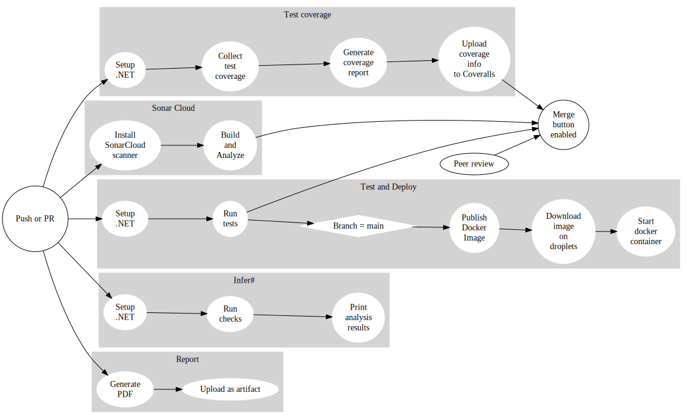

# Process' perspective
<!-- In essence it has to be clear how code or other artifacts come from idea into the running system and everything that happens on the way. !-->

## How we have interacted as developers
<!-- How do you interact as developers? -->
We have interacted with each other via pull requests. Whenever we wanted to merge a feature-branch to the main branch, we opened a pull request such that other developers could review the changes. The primary advantage of this, is that the developers that did not work on the feature, also gets a chance to understand what is going on. That is in addition to the improvements to code-quality that reviews can yield. Less formal communication has mainly happened through Messenger, while online voice-chat has been happening on Discord, which also allowed us to do pair-programming despite not meeting physically.

## Team organization
<!-- - How is the team organized? -->
We have not used any project management tools such as Kanban-boards, as we mainly stuck to the course-schedule, and because we are a quite small team, so it was fairly simple to organize work. GitHub issues were used to some degree in cases where we knew about a problem, but were unable to fix it at that time. Because of the course having weekly goals, we sort of worked in weekly sprints to keep up with the tasks. This is also why we strived to have at least a new release each week, however this was primarily in the beginning of the project, as quite few features were added later on.

# Tools in the CI/CD chain(s)
<!-- - A complete description of stages and tools included in the CI/CD chains.
    -  That is, including deployment and release of your systems. -->

Notes: The initial trigger is triggered either from
1) Pushes (merges) into main
2) Pushes to branches that have an open pull requests to main

## Coverage workflow

- .NET
- Coverage ReportGenerator
- Coveralls

## Infer# workflow

- Infer#

## Sonar workflow

## Test and deploy workflow

# Repository organization
<!-- - Organization of your repositor(ies).
  - That is, either the structure of of mono-repository or organization of artifacts across repositories.
  - In essence, it has to be be clear what is stored where and why. -->

We have chosen a mono repository structure.
This structure eliminates a lot of friction from working across different areas of the project and keeps related changes on different areas on the same branch. This also decreases friction from doing code reviews, since you only have to checkout a single branch to test a contribution, in stead of multiple branches across multiple repositories.

## Applied branching strategy

The branching strategy is based topic Branches: short lived feature branches and one main production branch. We chose this model because it keeps merge conflicts to a minimum, and because we have a lot of quality checks in our CI/CD chain,

The main branch gets deployed to production, if all checks passed. Feature branches can only be merged if two criteria are fulfilled:

1) All checks on the CI chain pass
2) At least one approving review

We have also practiced rebasing our branches before merging them, in order to test that new code works with the latest code on our main branch.

## Applied development process and tools supporting it
<!-- - Applied development process and tools supporting it
  - For example, how did you use issues, Kanban boards, etc. to organize open tasks -->

## Monitoring
<!-- - How do you monitor your systems and what precisely do you monitor? -->
### DigitalOcean
All webservers and the database cluster, are provided by DigitalOcean. This gives us a fixed monitoring solution for each server/cluster. The metrics for the webservers are, CPU usage, memory usage, disk I/O, disk usage and bandwidth. For the cluster, the metrics are amount of connections, index/sequential scans and throughput.

### Grafana

<!-- - What do you log in your systems and how do you aggregate logs? -->

## Logging solution
The solution uses a logging tool for ASP.NET Core called NLog. This allows us to make seven levels of logs (DEBUG, ERROR, FATAL, INFO, OFF, TRACE, WARN), which are written to date stamped *.log*-files, formatted as defined in *nlog.config*. These log files are stored in a docker volume which is mounted to the docker container. To enable ourselves to access these logs, we have created a /logs/{h@dd-mm-yyyy} endpoint, which displays logs for one hour in a table format. Additionally, accessing the /logs endpoint, will redirect the user to the newest logs. For ease of analyzing the logs, it is possible to toggle the INFO level of logs on or off.

Everything that is written to console will be logged by NLog. For example, uncaught exceptions will be logged as ERROR or FATAL, and the information printed when starting an ASP.NET Core application, is logged as INFO. In addition to what is automatically a part of the logging, the system writes an ERROR level log, whenever some request fails, containing information on why it failed. INFO level logs are also written when a request to post a message is received.

<!-- - Brief results of the security assessment. -->
# Security assessment

- Authentication was implemented in the same way as the original MiniTwit. This means that there is a single authorization-token that any request must contain. This is not particularly safe, as all users send the same token, so the user is not really verified. This is related to the second security risk of OWASP [https://owasp.org/www-project-top-ten/]

<!-- - Applied strategy for scaling and load balancing. -->

## Scaling and high availability strategy
### Database
The scalability of the database is provided by DigitalOcean.

~~For a scalable database solution, we use a postgresql database cluster via DigitalOcean. Moving to this solution came with a few benefits. The database management is handled entirely by DigitalOcean, including standby nodes with automatic switch over on failure for high availability. Additionally, we gained the monitoring that DigitalOcean provides and the ability to maintain the database and webserver, from the same interface.~~

### Webserver
Our web page is provided by a single DigitalOcean droplet server, accessed via a floating IP. Additionally, we have the DNS-name *twooter.hojelse.com* which points to the floating IP.

We did not successfully create a high availability setup for this. We tried to setup a switch over system, using keepalived and the DigitalOcean API.
