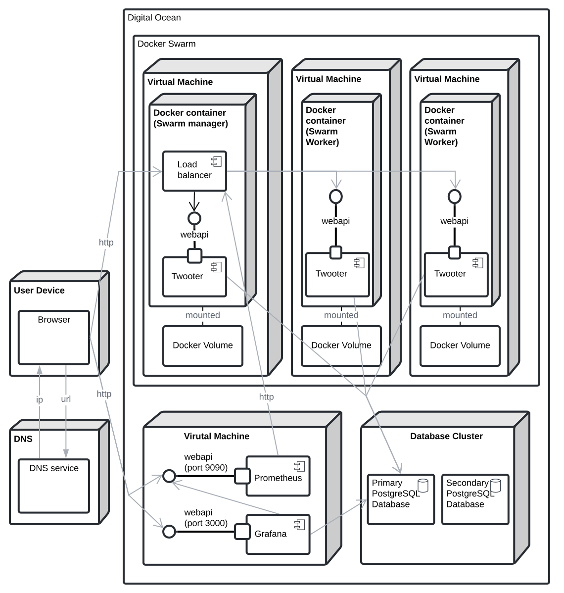

# Twooter - Evolving and maintaining a twitter clone with DevOps

<center>

Report and documentation of an _ITU-MiniTwit_ system associated with the course _DevOps, Software Evolution and Software Maintenance_ from IT University of Copenhagen.

**Date:**

May 19th 2021

**Course title:**

_DevOps - Software Evolution and Software Maintenance_

**Course id:**

BSDSESM1KU

**Course material:**

https://github.com/itu-devops/lecture_notes

### Group k - The Magic Strings

|         Name          |       E-mail       |
| :-------------------: | :----------------: |
|    Kasper S. Kyhl     | kaky&commat;itu.dk |
|      Emil Jäpelt      | emja&commat;itu.dk |
|    Jonas G. Røssum    | jglr&commat;itu.dk |
| Kristoffer B. Højelse | krbh&commat;itu.dk |
|   Thomas H. Kilbak    | thhk&commat;itu.dk |

</center>

<div style="page-break-after: always"></div>

---

# System's Perspective

## Design and Architecture

<!--
A description and illustration of the:
  - Design of your _ITU-MiniTwit_ systems

  - Architecture of your _ITU-MiniTwit_ systems
-->

The Twooter system is a Social Media platform composed of a .NET WebApi, a PostgreSQL database and a HTML templater serving static server rendered content.

## 3+1 Architectural Viewpoints

### Module Viewpoint


### Component and Connector Viewpoint


### Deployment Viewpoint



From a browser running on any device, you access Twooter by making a web request to the ip of the 

## Dependencies

The dependencies of the program can be seen on figure ???. Parts with grey background are external dependencies that we are using, while those on white background are classes or namespaces that we have made. Notably not present on the graph is the use of .Net 5.0, as this is so all-encompassing that we did not put it on the graph to make it more readable.


**_Figure ???: Dependency graph for the program. Those marked grey are external dependencies._**

This graph is quite simplified, as not all dependencies are listed, in order to improve readability. To get a look at the full list of dependencies, we used NDepend to generate a dependency matrix, which can be seen on the following figure. The horizontal axis represents our namespaces Api, Models, Shared and Entities, and then along the vertical axis then dependencies are listed. Cells with numbers on them, mean that the first one has that many references to the other.


**_Figure ???: Dependancy matrix. Each cell with a number represents the number of references from one namespace to the other._**

  <!--
  - All dependencies of your _ITU-MiniTwit_ systems on all levels of abstraction and development stages.
    - That is, list and briefly describe all technologies and tools you applied and depend on.
  -->

## Interactions of subsystems

 <!-- Important interactions of subsystems -->

## Current state of the system

<!--
  - Describe the current state of your systems, for example using results of static analysis and quality assessment systems.
  -->

## License

The license chosen for the project is Apache License 2.0, as the project is open to be used by others.
The dependencies used all have permissive licenses that allow them to be used without obtaining a unique license for the product. It is therefore believed that Apache License 2.0 complies with this.

The licenses for the dependencies are listed below. We assume that each dependency also complies to the licenses of its sub-dependencies.

- Prometheus: Apache License 2.0[^Prometheus license]
- Grafana: GNU Affero General Public License v3.0 [^Grafana license]
- Entity Framework Core: Apache License 2.0[^EFCore license]
- AspNetCore: Apache License 2.0[^aspnetcore license]
- Npgsql: PostgreSQL License (BSD-style)[^Npgsql license]
- PostgreSQL: PostgreSQL License (BSD-style)[^PostgreSQL license]
- NLog: BSD 3-Clause "New" or "Revised" License[^NLog license]

[^Prometheus license]: https://github.com/prometheus/prometheus/blob/main/LICENSE
[^Grafana license]: https://github.com/grafana/grafana/blob/main/LICENSE
[^EFCore license]: https://github.com/dotnet/efcore/blob/main/LICENSE.txt
[^aspnetcore license]: https://github.com/dotnet/aspnetcore/blob/main/LICENSE.txt
[^Npgsql license]: https://github.com/npgsql/npgsql/blob/main/LICENSE
[^PostgreSQL license]: https://www.postgresql.org/about/licence/
[^NLog license]: https://github.com/NLog/NLog/blob/dev/LICENSE.txt

<!--
Finally, describe briefly, if the license that you have chosen for your project is actually compatible with the licenses of all your direct dependencies.


Double check that for all the weekly tasks (those listed in the schedule) you include the corresponding information. TODO what?
!-->

# Process' perspective

<!-- In essence it has to be clear how code or other artifacts come from idea into the running system and everything that happens on the way. !-->

## How we have interacted as developers

<!-- How do you interact as developers? -->

We have interacted with each other via pull requests. Whenever we wanted to merge a feature-branch to the main branch, we opened a pull request such that other developers could review the changes. The primary advantage of this, is that the developers that did not work on the feature, also gets a chance to understand what is going on. That is in addition to the improvements to code-quality that reviews can yield. Less formal communication has mainly happened through Messenger, while online voice-chat has been happening on Discord, which also allowed us to do pair-programming despite not meeting physically.

## Team organization

<!-- - How is the team organized? -->

Because of the course having weekly goals, we sort of worked in weekly sprints to keep up with the tasks. This is also why we strived to have at least a new release each week, however this was primarily in the beginning of the project, as quite few features were added later on.
Other than that, the team was not very strictly organized, as it is a quite small team, and the members all had a very similar way of working. That being a fairly relaxed atmosphere where work can be done whenever we feel like it, as long the goal is reached.
Stricter organization might have been beneficial as we were unable to meet physically.

# Tools in the CI/CD chain(s)

<!-- - A complete description of stages and tools included in the CI/CD chains.
    -  That is, including deployment and release of your systems. -->

When pushing or merging to the main-branch, five different GitHub Actions are initialized. Three of these are intended to be used to improve code-quality, one tests and deploys the project, and one generates this report. They are visualized on the following figure.


**_Figure ???: Graph showing the GitHub Actions configured for the project._**

**Notes:** The initial trigger is triggered either from pushes to branches that have an open pull requests to main branch, or from a push (or merge) to the main branch.

## Coverage workflow

To determine the test coverage of our test suite, a coverage workflow is used.
It consists of three steps. The first step is running the tests and generating coverage data. The second step generates a downloadable test coverage report. The third step sends the code coverage data to a service called Coveralls, that automatically displays test coverage on pull requests.

## Infer# workflow

Infer# is a static code analysis tool that detects null dereferences and resource leaks in the codebase. It has never reported any issues during development.

## Sonar Cloud workflow

Sonar Cloud is a static analysis tool that detects bugs, vulnerabilities and bad coding practices. After opening a pull request, a Sonar Cloud bot comments its report, such that we know if there are any problems with the code about to be merged. This occured at least once during development. The service then provides information on why it is a problem and how to address the issue.

## Test and deploy workflow

The test and deploy workflow is responsible for running tests and optionally deploying the system to production. If this workflows is triggered by a merge or push to the main branch, the Test and Deploy workflow continues beyond the test execution and also deploys the system.

Here is a snippet from the workflow:

```bash
  deploy:
    needs: publish-docker-image
    runs-on: ubuntu-latest
    if: github.ref == 'refs/heads/main'
    steps:
      - name: Configure SSH
        run: |
        ...

      - name: Pull and run docker image with SSH
        # Run ssh with config file and script
        # Script will install docker, login to github packages and pull new image, stop and clean up old deployment, run the new image in a new container
        run: |
          ssh staging "
            apt update
            apt install -y docker.io

            docker login https://docker.pkg.github.com -u ${{ github.actor }} -p ${{ secrets.GITHUB_TOKEN }}
            docker pull docker.pkg.github.com/themagicstrings/twooter/twooter:latest

            docker service rm twooter-instance
            docker service create \
              --with-registry-auth \
              -p 443:443 \
              -p 80:80 \
              --mount 'type=volume,src=twooter-logs,dst=/publish/logs,volume-driver=local' \
              --name twooter-instance \
              -e \"DB_IP=${{ secrets.DB_IP }}\" \
              -e \"DB_PASSWORD=${{ secrets.DB_PASSWORD }}\" \
              -e \"DB_CONNECTION_STRING=${{ secrets.DB_CONNECTION_STRING }}\" \
              docker.pkg.github.com/themagicstrings/twooter/twooter:latest
            docker service scale twooter-instance=3
          "
```

As you can see from the snippet, the

# Repository organization

<!-- - Organization of your repositor(ies).
  - That is, either the structure of of mono-repository or organization of artifacts across repositories.
  - In essence, it has to be be clear what is stored where and why. -->

We have chosen a mono repository structure.
This structure eliminates a lot of friction from working across different areas of the project and keeps related changes on different areas on the same branch. This also decreases friction from doing code reviews, since you only have to checkout a single branch to test a contribution, in stead of multiple branches across multiple repositories.

## Applied branching strategy

The branching strategy is based topic Branches: short lived feature branches and one main production branch. We chose this model because it keeps merge conflicts to a minimum, and because we have a lot of quality checks in our CI/CD chain,

The main branch gets deployed to production, if all checks passed. Feature branches can only be merged if two criteria are fulfilled:

1. All checks on the CI chain pass
2. At least one approving review

We have also practiced rebasing our branches before merging them, in order to test that new code works with the latest code on our main branch.

## Applied development process and tools supporting it

We have not used any project management tools such as Kanban-boards, as we mainly stuck to the course-schedule, and because we are a quite small team, so it was fairly simple to distribute tasks. GitHub issues were used to some degree in cases where we knew about a problem, but were unable to fix it at that time. Only 6 issues were opened in total, because we strived to fix problems when they came up, as resolving problems quickly was one of the main tasks in the course.

<!-- - Applied development process and tools supporting it
  - For example, how did you use issues, Kanban boards, etc. to organize open tasks -->

## Monitoring

<!-- - How do you monitor your systems and what precisely do you monitor? -->

### DigitalOcean

All webservers and the database cluster, are provided by DigitalOcean. This gives us a fixed monitoring solution for each server/cluster. The metrics for the webservers are, CPU usage, memory usage, disk I/O, disk usage and bandwidth. For the cluster, the metrics are amount of connections, index/sequential scans and throughput.

### Grafana

All other metrics, that are not machine level, are available on a Grafana dashboard. Grafana is able to have many diffrent sources of metrics to be displayed, and is therefor a fine choice.


**_Figure ???: The Grafana monitoring dashboard used in the project_**

For the webservers, these metrics are generated by the Prometheus library for C#, and then collected and stored by a Prometheus instance running on the server. The only metric displayed on the dashboard is the amount of requests for each action and HTTP response code.

For the database server, Grafana is able to make queries to the database to collect metrics. As of this report the collected metrics are relation sizes both in amount of rows and in MB.

<!-- - What do you log in your systems and how do you aggregate logs? -->

## Logging solution

The solution uses a logging tool for ASP.NET Core called NLog. This allows us to make seven levels of logs (DEBUG, ERROR, FATAL, INFO, OFF, TRACE, WARN), which are written to date stamped _.log_-files, formatted as defined in _nlog.config_. These log files are stored in a docker volume which is mounted to the docker container. To enable ourselves to access these logs, we have created a /logs/{h@dd-mm-yyyy} endpoint, which displays logs for one hour in a table format. Additionally, accessing the /logs endpoint, will redirect the user to the newest logs. For ease of analyzing the logs, it is possible to toggle the INFO level of logs on or off.

Everything that is written to console will be logged by NLog. For example, uncaught exceptions will be logged as ERROR or FATAL, and the information printed when starting an ASP.NET Core application, is logged as INFO. In addition to what is automatically a part of the logging, the system writes an ERROR level log, whenever some request fails, containing information on why it failed. INFO level logs are also written when a request to post a message is received.

<!-- - Brief results of the security assessment. -->

## Security assessment

Authentication was implemented in the same way as the original MiniTwit. This means that there is a single authorization-token that any request must contain. This is not particularly safe, as all users send the same token, so the user is not really verified. This is related to the second security risk of OWASP [^1]. However in our case, this is considered a minor problem, as it is just a quirk of how the original MiniTwit was made.
Our logging is also somewhat lacking, which is related to security risk number 10. A lot of information is logged, including thrown exceptions, when users post messages, etc. However, there is no warning about potential attacks, or warnings if it suddenly experiences a sudden spike in errors. This means that we can only find errors if we are looking for them, so a threat can potentially be present for a long time without us noticing.

[^1]: https://owasp.org/www-project-top-ten/

<!-- - Applied strategy for scaling and load balancing. -->

## Scaling and high availability strategy

### Database

For a scalable database solution, we use a PostgreSQL database cluster via DigitalOcean, with one standby node. This solution is fully managed by DigitalOcean, which includes daily backups and automatic switchover, should the primary node fail. Should the service require scaling, read-only nodes can be added to datacenters across the world, making the solution horizontaliy scalable.

### Webserver

Our web page is provided by a docker swarm, consisting of one manager node and two worker nodes. In this swarm, three instances of the application are running, and should any of them fail, the manager will ensure that a new instance is started, making this a high availability setup. For horizontal scaling, more worker nodes can be added to the swarm, and the manager configured to ensure more instances exist.

# Lessons Learned Perspective

<!--
Describe the biggest issues, how you solved them, and which are major lessons learned with regards to:
  - evolution and refactoring
  - operation, and
  - maintenance
of your _ITU-MiniTwit_ systems. Link back to respective commit messages, issues, tickets, etc. to illustrate these.
Also reflect and describe what was the "DevOps" style of your work. For example, what did you do differently to previous development projects and how did it work?
!-->

## Evolution of our database solution

When we first deployed our system, we used an in-memory database. This was naturally a flawed solution for any system that needs to persist data and will be redeployed with any frequency.

We changed to a docker container running a MSSQL Server image, on a separate DigitalOcean droplet server. This solution did not work had some big issues. By default, MSSQL Server will try to keep as much data as it can in memory, to speed up queries. In our case the memory usage would steadily climb, until the container was starved for resources, and any operation would slow to a near halt causing response timeouts.

Our attempt to fix this, was simply to not use a docker container, instead running as MSSQL Server directly on a droplet server. This did help reduce the speed at which the database would be starved, although it did still occur. To solve this we read quite a few articles on configuration issues that a MSSQL Server could have. One such issue, was that the default configuration had a maximum memory usage of around 2 TB, which is more than our server has. After correcting the configuration, it no longer would starve itself.

This solution is however not scalable. Our final solution was a PostgreSQL database cluster provided by DigitalOcean. Moving to this solution came with a few benefits. The database management is handled entirely by DigitalOcean, including standby nodes with automatic switch over on failure for high availability. Additionally, we gained the monitoring that DigitalOcean provides and the ability to maintain the database and webserver, from the same interface.

One additional note, on the transition between different database management systems (i.e. MSSQL & PostgreSQL): Migrating to a new DBMS does provide some issues, as the representation of data may differ. There may exist tools that would be able to transform a snapshot of one database to another. Our solution, however, was simply retrofitting our source code, with a "data siphon" and a connection to the old and the new database, launching the program on our own machines and transferring the data this way.

## Logging of errors over time

The course has a website that shows the number of errors found be the simulator, which is very useful to see which errors are most common in the system. A problem with this, is that is only shows the culmulative number of errors, so it is impossible to know when the errors occured. We tried to work around this by making a scraper that periodically would poll data from the site, and save it with a time-stamp. This turned out to be quite difficult, as pulling the data out of the SVG, was not that easily done. As a replacement, we made a spreadsheet where we manually put in the data every few days. The data gathered can be seen on the following graphs.


**_Figure ???: Graphs made in Google Sheets displaying the errors from the simulator over time. This data was input manually._**

Using this data, we were able to react to sudden spikes in errors, for example the rapid growth in errors of type Follow and Unfollow, caused us to investigate the problem. It turned out that the problem was due to missing users in the database, so we solved it by copying users from another group's database into ours. This is related to what was explained in the previous section. On the graph named _Major Errors_ it can be seen the the red and yellow lines suddenly flatten out, as the problem was resolved.
Another way we have used the graph, is to identify when the service is down, as this causes a surge in connection errors.
Ideally this tool would not be necessary, as it has to be updated manually which takes time, and the things that it warns us of, should be covered by either monitoring or logging. However, in this case where our monitoring is a bit lacking, it was a very useful tool.
