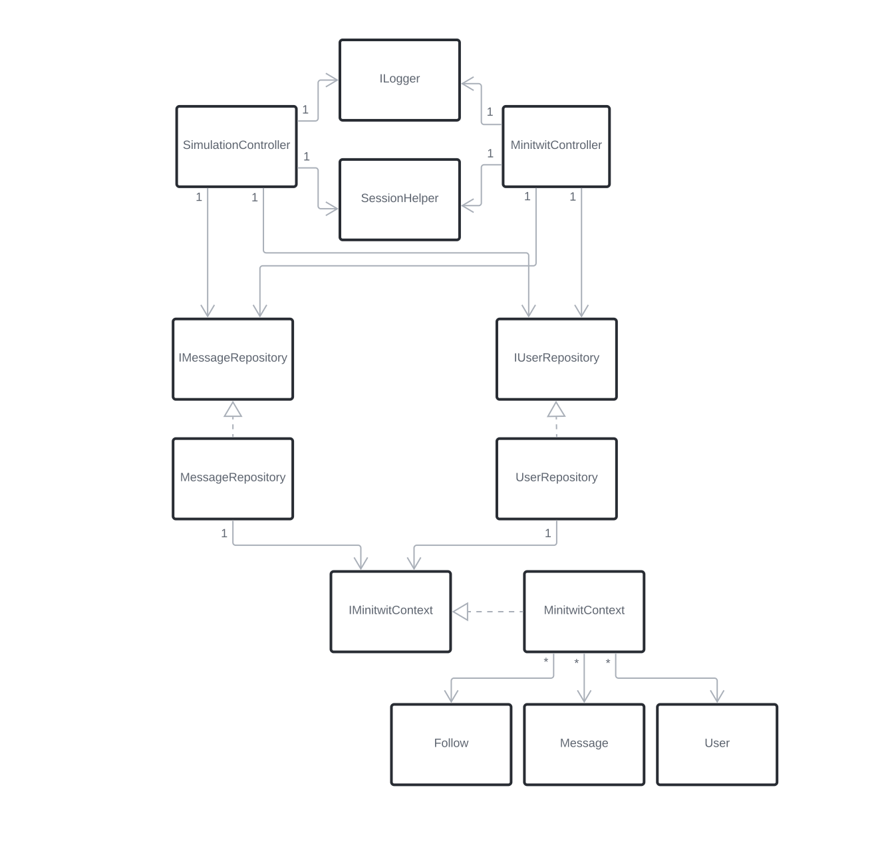
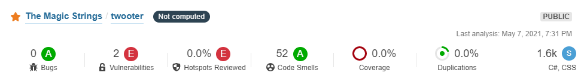

# Twooter   - Evolving and maintaining a Twitter clone with DevOps

Report and documentation of an _ITU-MiniTwit_ system associated with the course _DevOps, Software Evolution and Software Maintenance_ from IT University of Copenhagen.

**Date:**

May 19th 2021

**Course title:**

_DevOps - Software Evolution and Software Maintenance_

**Course id:**

BSDSESM1KU

**Course material:**

https://github.com/itu-devops/lecture_notes

### Group k - The Magic Strings

|         Name          |       E-mail       |
| :-------------------: | :----------------: |
|    Kasper S. Kyhl     | kaky&commat;itu.dk |
|      Emil Jäpelt      | emja&commat;itu.dk |
|    Jonas G. Røssum    | jglr&commat;itu.dk |
|  Kristoffer Højelse   | krbh&commat;itu.dk |
|   Thomas H. Kilbak    | thhk&commat;itu.dk |

# System's Perspective

## Design and Architecture

The Twooter system is a Social Media platform composed of a .NET Web Api, a PostgreSQL database and an HTML-templater serving server-rendered content. The templater is not particularly advanced, and somewhat hinders the expandability of the system. Using a modern front-end framework would have been more fitting for expandability, however the templater made it simple to recreate the design of the original MiniTwit, hence why it was chosen.

The following subsections describes the Twooter system from different viewpoints in the style of Christensen's 3+1 Architectural Viewpoints.

### Module Viewpoint

The structure of the modules can be seen on _Figure 1_. It contains these modules (Test-classes and some misc. files omitted):

| Module   | Purpose                                                                                                                                       |
| -------- | --------------------------------------------------------------------------------------------------------------------------------------------- |
| API      | The main console app with the Program and Startup classes, as well as the controllers for the web API. BasicTemplater is also situated in this module. |
| Entities | Objects for the database, as well as the database context.                                                                                    |
| Models   | Repositories for interactions with the database.                                                                                                  |
| Shared   | Contains data transfer objects (DTO's) that are used to pass data between other classes and the database.                                     |

As seen on _Figure 1_, web requests are handled by two controllers. The SimulationController has to adhere to a strict specification set by the simulator, which differs a lot from how a user might want the same information presented.

For example, where the SimulatorController might return a BadRequest, the MinitwitController would return an HTML-page containing an error message.

For this reason MinitwitController handles all user oriented web requests that returns the information wrapped in a pretty UI.

_**Figure 1:** Module Diagram showing the classes and sub-modules in each module_

The dependencies between the most important classes and interfaces in the system can be seen on _Figure 2_.

_**Figure 2:** Class Diagram showing inheritance and the realtions between classes_

### Component and Connector Viewpoint

_Figure 3_ shows the sequence of subsystem interactions, that occur in the case that a user accesses the _/public_ endpoint. Nearly all use cases for the system follow this structure.

> 1. A method is called on a Controller object
> 2. The Controller object checks if the user is logged in
> 3. The Controller object calls some methods on its repositories
> 4. The repositories execute the methods and returns some result to the controller
> > 5A. In the case of the MinitwitController, the result from the repositories is send to the BasicTemplater to generate HTML, or a redirect is issued \
> > 5B. In the case of the SimulationController, the result from the repositories is formatted to adhere to the simulator
> 6. The result is returned to the User

_**Figure 3:** Sequence Diagram of a GetPublicTimeline request_

### Deployment Viewpoint

From a browser running on any device, you can access Twooter by making a web request to the IP of the Virtual Machine running the Swarm Manager. If you don't know the IP you can ask a DNS provider with the url [http://twooter.hojelse.com](http://twooter.hojelse.com).

The Swarm manager is a Docker container assigned as manager in the Docker Swarm configuration. The swarm manager has a load balancer which routes the web request to one of the three containers each running a Twooter instance from a Docker Image. Each container is running on a separate Virtual Machine. Each container has been configured with a Docker Volume, a data repository, mounted by the container.

The PostgreSQL database runs in a _Database Cluster_ provided by Digital Ocean. The primary database is replicated by the secondary database, such that queries can be rerouted, in the event that the primary database is unresponsive.

Our tools for monitoring Prometheus and Grafana (see _Monitoring_), runs on a Virtual Machine exposing a Web API on ports 9090 and 3000 respectively. Prometheus scrapes and stores monitoring data by accessing the IP of the Docker Swarm Manager. Grafana is configured with two data sources:

1. Prometheus, by accessing the Web API on port 9090
2. The PostgreSQL database with a connection string and SQL queries.

An overview of the deployed system can be seen on _Figure 4_.

_**Figure 4:** Deployment Diagram. The open arrows indicate requests, and filled arrow heads indicate synchronous messages. Replies to requests are generally not shown._

## Dependencies

<!--
- All dependencies of your _ITU-MiniTwit_ systems on all levels of abstraction and development stages.
  - That is, list and briefly describe all technologies and tools you applied and depend on.
-->

The dependencies of the program can be seen on _Figure 5_. Nodes with grey background are external dependencies that we are using, while those on white background are classes or namespaces that we have made. Notably not present on the graph is the use of .NET 5.0, as this is so all-encompassing that we did not put it on the graph to make it more readable. This graph is quite simplified, as not all dependencies are included, in order to improve readability.

_**Figure 5:** Dependency graph for the program. Nodes marked with grey are external dependencies._

To get a look at the full list of dependencies, we used NDepend to generate a dependency matrix, which can be seen on _Figure 6_. The horizontal axis represents our namespaces: _Api_, _Models_, _Shared_ and _Entities_, and then along the vertical axis the dependencies are listed. Cells with numbers on them, mean that the first one has that many references to the other. For example, the API has 46 references to System.Runtime.

_**Figure 6:** Dependency matrix. Each cell with a number represents the number of references from one namespace to the other._

## Current state of the system

<!--
  - Describe the current state of your systems, for example using results of static analysis and quality assessment systems.
  -->

Taking a look at SonarCloud on _Figure 7_, we can see that it detects two vulnerabilities, two security hotspots and 52 code smells. The main reason that these were not resolved, is that we were not aware of these, as we did not fully utilize the possibilities of SonarCloud. The code smells are primarily related to using less strict access modifiers than what is possible, which is of little importance, because we are building an application and not a library. The vulnerabilities are about the application redirecting to pages based on the user's input. This could be an issue, but should not be a major security issue.
In terms of technical debt, it estimates 5 hours of technical debt, which is not that much considering the project has been running for about three months.

_**Figure 7:** Information from the SonarCloud dashboard. The 0.0% test coverage is because it has not been configured, since we use another service for code coverage._

## License

<!--
Finally, describe briefly, if the license that you have chosen for your project is actually compatible with the licenses of all your direct dependencies.

Double check that for all the weekly tasks (those listed in the schedule) you include the corresponding information.
!-->

The license chosen for the project is Apache License 2.0, as the project is open to be used by others.
The dependencies used all have permissive licenses that allow them to be used without obtaining a unique license for the product. It is therefore believed that the Apache License 2.0 complies with this.

The licenses for the dependencies are listed below. We assume that each dependency also complies to the licenses of its sub-dependencies.

- Prometheus: Apache License 2.0 [Prometheus license]
- Grafana: GNU Affero General Public License v3.0 [Grafana license]
- Entity Framework Core: Apache License 2.0 [EFCore license]
- AspNetCore: Apache License 2.0 [aspnetcore license]
- Npgsql: PostgreSQL License (BSD-style) [Npgsql license]
- PostgreSQL: PostgreSQL License (BSD-style) [PostgreSQL license]
- NLog: BSD 3-Clause "New" or "Revised" License [NLog license]
- .NET: MIT License [.NET license]

[prometheus license]: https://github.com/prometheus/prometheus/blob/main/LICENSE
[grafana license]: https://github.com/grafana/grafana/blob/main/LICENSE
[efcore license]: https://github.com/dotnet/efcore/blob/main/LICENSE.txt
[aspnetcore license]: https://github.com/dotnet/aspnetcore/blob/main/LICENSE.txt
[npgsql license]: https://github.com/npgsql/npgsql/blob/main/LICENSE
[postgresql license]: https://www.postgresql.org/about/licence/
[nlog license]: https://github.com/NLog/NLog/blob/dev/LICENSE.txt
[.net license]: https://github.com/dotnet/runtime/blob/main/LICENSE.TXT

# Process' perspective

<!-- In essence it has to be clear how code or other artifacts come from idea into the running system and everything that happens on the way. !-->

## Developer interactions

<!-- How do you interact as developers? -->

We have interacted with each other mainly via pull requests. In the course of the project, 55 pull requests were opened. Whenever we wanted to merge a feature-branch to the main branch, we opened a pull request such that other developers could review the changes. The primary advantage of this, is that the developers that did not work on the feature, also gets a chance to understand what is going on. That is in addition to the improvements to code-quality that reviews can yield. Less formal communication has mainly happened through Messenger, while online voice-chat has been conducted through the Discord platform, which also allowed us to do pair-programming despite not meeting physically.

## Team organization

<!-- - How is the team organized? -->

Because of the course having weekly goals we, to some extent, worked in weekly sprints to keep up with the tasks. This is also why we strived to have at least a new release each week, however this was primarily in the beginning of the project, as quite few features were added later on.
Other than that, the team was not very strictly organized, as it is a quite small team, and the members all had a very similar way of working. That being, a fairly relaxed atmosphere, where work can be done whenever we feel like it, as long the goal is reached.
Stricter organization might have been beneficial as we were unable to meet physically, which sometimes caused us not to be available at the same time.

## Tools in the CI/CD chain(s)

<!-- - A complete description of stages and tools included in the CI/CD chains.
    -  That is, including deployment and release of your systems. -->

When merging to the main-branch or pushing to branches that have an open pull requests to main branch, five different GitHub Actions workflows are initialized. Three of these are intended to be used to improve code-quality, one tests and deploys the project, and one generates this report.

For an overview of the CI/CD chain, see _Figure 8_.

### Coverage workflow

To determine the test coverage of our test suite, a coverage workflow is used.
It consists of three steps. The first step is running the tests and generating coverage data. The second step generates a downloadable test coverage report. The third step sends the code coverage data to a service called Coveralls, that automatically displays test coverage on pull requests.

### Infer# workflow

Infer# is a static code analysis tool that detects null dereferences and resource leaks in the codebase. The problems reported has been of little significance, so we chose to remove it as a requirement on pull requests.

### SonarCloud workflow

SonarCloud is a static analysis tool that detects bugs, vulnerabilities and bad coding practices. After opening a pull request, a SonarCloud bot comments its report, such that we know if there are any problems with the code about to be merged. This occured multiple times during development. The service then provides information on why it is a problem and how to address the issue.

### Test and deploy workflow

The test and deploy workflow is responsible for running tests and conditionally deploying the system to production. If this workflow is triggered by a merge to the main branch, the Test and Deploy workflow continues beyond the test execution and also deploys the system. The deployment step of the workflow, releases an updated image of the application, connects to the VM containing the swarm manager, pulls down the updated image and spins up the service on all VM's.

There is no roll-out strategy, so therefore when deploying, it closes the service, and then there is a bit of downtime until the deployment completes. If the deployment fails, then the service will be offline, until manually started again.

_**Figure 8:** Graph showing the GitHub Actions workflows configured for the project._

## Repository organization

<!-- - Organization of your repositor(ies).
  - That is, either the structure of of mono-repository or organization of artifacts across repositories.
  - In essence, it has to be be clear what is stored where and why. -->

We have chosen a mono repository structure. This made the most sense, as our solution is a single dotnet solution, so splitting it across multiple repositories, would not work well.
This structure eliminates a lot of friction from working across different areas of the project and keeps related changes in different areas on the same branch. This also decreases friction from doing code reviews, since you only have to checkout a single branch to test a contribution, instead of multiple branches across multiple repositories.

### Applied branching strategy
The branching strategy is based on topic branches: short lived feature branches and one main production branch. We chose this model because it keeps merge conflicts and general complexity of shipping features and bug fixes to a minimum. We have a lot of quality checks in our CI chain, which gives us the confidence to do continuously delivery.

The main branch gets deployed to production, if all checks pass. Feature branches can only be merged if two criteria are fulfilled:

1. All checks on the CI chain pass
2. At least one approving review

We have also practiced rebasing our branches before merging them, in order to test that new code works with the latest code on our main branch.

### Applied development process and tools supporting it

We have not used any project management tools such as Kanban-boards, as we mainly stuck to the course-schedule, and because we are a quite small team, so it was fairly simple to distribute tasks. GitHub issues were used to some degree in cases where we knew about a problem, but were unable to resolve it immediately. Only six issues were opened in total, because we strived to fix problems when they came up, as resolving problems quickly was one of the main tasks in the course.

If this project had a bigger scope, a Kanban-board on GitHub would probably have been the chosen tool.

<!-- - Applied development process and tools supporting it
  - For example, how did you use issues, Kanban boards, etc. to organize open tasks -->

## Monitoring

<!-- - How do you monitor your systems and what precisely do you monitor? -->

### DigitalOcean

All servers and the database cluster, are provided by DigitalOcean. This gives us a fixed monitoring solution for each server/cluster. The metrics for the web servers are: CPU usage, memory usage, disk I/O, disk usage and bandwidth. For the cluster, the metrics are amount of connections, index/sequential scans and throughput.

### Grafana

All other metrics, that are not machine level, are available on a Grafana dashboard. Grafana is able to have many different sources of metrics to be displayed, and is therefore a good choice of dashboard for monitoring purposes.

For the web servers, these metrics are generated by the Prometheus library for C#, and then collected and stored by a Prometheus instance running on the server. The only metric displayed on the dashboard is the amount of requests for each action and HTTP response code.

For the database server, Grafana is able to make queries to the database to collect metrics. As of this report the collected metrics are relation sizes both in amount of rows and in MB.

_**Figure 9:** The Grafana monitoring dashboard used in the project_

<!-- - What do you log in your systems and how do you aggregate logs? -->

## Logging solution

The solution uses a logging tool for ASP.NET Core called NLog. This allows us to make seven levels of logs (DEBUG, ERROR, FATAL, INFO, OFF, TRACE, WARN), which are written to date stamped _.log_-files, formatted as defined in _nlog.config_. These log files are stored in a docker volume which is mounted to the docker container. To enable ourselves to access these logs, we have created a /logs/{h@dd-mm-yyyy} endpoint, which displays logs for one hour in a table format. Additionally, accessing the /logs endpoint, will redirect the user to the newest logs. For ease of analyzing the logs, it is possible to toggle the INFO level of logs on or off.

Everything that is written to console will be logged by NLog. For example, uncaught exceptions will be logged as ERROR or FATAL, and the information printed when starting an ASP.NET Core application, is logged as INFO. In addition to what is automatically a part of the logging, the system writes an ERROR level log, whenever some request fails, containing information on why it failed. INFO level logs are also written when a request to post a message is received.

After changing to a horizontally scalable setup, we did not manage to modify our logging solution to support aggregating logs from multiple sources.

## Security assessment

The application is protected against XSS, as all user input is sanitized using HtmlEncode from the HttpUtility package. This ensures that even if a malicious request includes JavaScript or other HTML code, it will not be executed.

Since we use Object-Relational Mapping, we do not write SQL statements directly and the system is therefore protected against SQL injection attacks.

The most critical attack that could occur, would be if someone got access to our database. In addition to the database having a strong password stored in GitHub Secrets, this is prevented with a whitelist of IP's that are allowed to connect to the database. In order to gain access to the database cluster, one would need to either gain access to our DigitalOcean account and whitelist their own IP, or compromise one of the whitelisted computers and obtain the database credentials.

Authentication of http-requests to the API was implemented in the same way as the original MiniTwit. This means that there is a single authorization-token that any request must contain. This is not particularly safe, as all users send the same token, so the user is not really verified. This is related to the second security risk of [OWASP Top Ten]. However, in our case, this is considered a minor problem, as it is just a quirk of how the original MiniTwit was made.

Our logging is also somewhat lacking, which is related to OWASP security risk number 10. A lot of information is logged, including thrown exceptions, when users post messages, etc. However, there is no warning about potential attacks, or warnings if it experiences a sudden spike in errors. This means that we can only find errors if we are looking for them, so a threat can potentially be present for a long time without us noticing.

[owasp top ten]: https://owasp.org/www-project-top-ten/

<!-- - Applied strategy for scaling and load balancing. -->

## Scaling and high availability strategy

### Database

For a scalable database solution, we use a PostgreSQL database cluster via DigitalOcean, with one standby node. This solution is fully managed by DigitalOcean, which includes daily backups and automatic switchover, should the primary node fail. Should the service require scaling, read-only nodes can be added to data centers across the world, making the solution horizontally scalable.

### Web server

Our web application is provided by a docker swarm, consisting of one manager node and two worker nodes. In this swarm, three instances of the application are running, and should any of them fail, the manager will ensure that a new instance is started, making this a high availability setup. For horizontal scaling, more worker nodes can be added to the swarm, and the manager configured to ensure more instances exist.

# Lessons Learned Perspective

<!--
Describe the biggest issues, how you solved them, and which are major lessons learned with regards to:
  - evolution and refactoring
  - operation, and
  - maintenance
of your _ITU-MiniTwit_ systems. Link back to respective commit messages, issues, tickets, etc. to illustrate these.
Also reflect and describe what was the "DevOps" style of your work. For example, what did you do differently to previous development projects and how did it work?
!-->

## Evolution of our database solution

In the first iteration of the system, we used an in-memory database. This was naturally a flawed solution for any system that needs to persist data and will be redeployed with any frequency.

We changed to a docker container running an MSSQL Server image, firstly on the webserver ([Pull request #20](https://github.com/themagicstrings/twooter/pull/20)), then on a separate DigitalOcean droplet server ([Pull request #30](https://github.com/themagicstrings/twooter/pull/30)). These solutions had some big issues. By default MSSQL Server will try to keep as much data as it can in memory to speed up queries. In our case the memory usage would steadily climb, until the container was starved for resources, and any operation would slow to a near halt causing response timeouts.

Our attempt to fix this, was simply to not use a docker container, instead running as MSSQL Server directly on a droplet server. This did help reduce the speed at which the database would be starved, although it did still occur. To solve this we read quite a few articles on configuration issues that an MSSQL Server could have. One such issue, was that the default configuration had a maximum memory usage of around 2 TB, which is more than our server has. After correcting the configuration, it no longer would starve itself.

This solution is however not scalable. Our final solution was a PostgreSQL database cluster provided by DigitalOcean ([Pull request #55](https://github.com/themagicstrings/twooter/pull/55)). Moving to this solution came with a few benefits. The database management is handled entirely by DigitalOcean, including standby nodes with automatic switch over on failure for high availability. Additionally, we gained the monitoring that DigitalOcean provides and the ability to maintain the database and web server from the same interface.

One additional note, on the transition between different database management systems (i.e. MSSQL & PostgreSQL): Migrating to a new DBMS does provide some issues, as the representation of data may differ. There may exist tools that would be able to transform a snapshot of one database to another. Our solution, however, was simply retrofitting our source code, with a "data siphon" and a connection to the old and the new database, launching the program on our own machines and transferring the data this way.

## Logging of simulator errors over time

The course has a website that shows the number of errors found be the simulator, which is very useful to see which errors are most common in the system. A problem with this, is that it only shows the cumulative number of errors, so it is impossible to know when the errors occured. We tried to work around this by making a scraper that periodically would poll data from the site, and save it with a time-stamp. This turned out to be quite difficult, as pulling the data out of the SVG, was not that easily done. As a replacement, we made a spreadsheet where we manually put in the data every few days, as seen on _Figure 10_.

_**Figure 10:** Graphs made in Google Sheets displaying the errors from the simulator over time. The data was recorded manually._

Using this data, we were able to react to sudden spikes in errors, for example the rapid growth in errors of type Follow and Unfollow, caused us to investigate the problem. It turned out that the problem was due to missing users in the database, so we solved it by copying users from another group's database into ours. On the graph named _Major Errors_ it can be seen that the red and yellow lines suddenly flatten out, as the problem was resolved.
Another way we have used the graph, is to identify when the service is down, as this causes a surge in connection errors.
Ideally this tool would not be necessary, as it has to be updated manually which takes time, and the things that it warns us of, should be covered by either monitoring or logging. However, in this case where our monitoring is a bit lacking, it was a very useful tool.

## GitHub Actions has no debugging mode

When creating a GitHub Actions script you will never get it perfect the first time. Figuring out why the script is not behaving like it should, is without auxiliary programs a process of repeatedly pushing a new commit to GitHub, waiting for their service to run the script, and finally reading the console output on the website. See for instance [Pull request #8](https://github.com/themagicstrings/twooter/pull/8). A time consuming process which we haven't gotten around to making better. 3rd party tools are available to run GitHub Actions scripts locally, which should speed this process up a lot. It was a minor inconvenience which could have been avoided with a little preliminary research.

## Working with DevOps
Compared to previous projects, in this project we have focused on having as much uptime of the service as possible, automating as many processes as possible, and improving our Git-workflow as a team.
Improving our Git-workflow to incorporate reviews and static analysis, is critical to also having high uptime. This is because if we merge faulty code to the main branch, then the deployment might fail, causing the service to go offline.

Automation of, for example, running tests and deployment has been a great learning experience for us. The things we have learned in this course, has made us start to use similar tools in other projects (such as the Second Year Project on SWU). Thinking of continuous deployment from day 1 ties very well into the Scrum framework's focus on incremental user value.

<!--TODO Link back to respective commit messages, issues, tickets, etc. to illustrate these.
Also reflect and describe what was the "DevOps" style of your work. For example, what did you do differently to previous development projects and how did it work?-->

# Links

- [Main repository](https://github.com/themagicstrings/twooter) - https://github.com/themagicstrings/twooter

  Contains the entire project.

- [Twooter](http://twooter.hojelse.com) - http://twooter.hojelse.com

  This is the link to the minitwit service itself. Includes both the minitwit application and Simulator API.

- [Twooter logs](http://twooter.hojelse.com/logs) - http://twooter.hojelse.com/logs

  Link to the logging solution.

- [Grafana](http://188.166.113.237:3000/) - http://188.166.113.237:3000/

  Grafana monitoring dashboard. The username and password is 'admin'.

- [Prometheus](http://188.166.113.237:9090/) - http://188.166.113.237:9090/

  Prometheus metrics page. Contains all metrics for the web servers.

- [Twooter API Spec](http://twooter.hojelse.com/swagger/index.html) - http://twooter.hojelse.com/swagger/index.html

  Automatically generated API specification.

- [SonarCloud](https://sonarcloud.io/dashboard?id=themagicstrings_twooter) - https://sonarcloud.io/dashboard?id=themagicstrings_twooter

  Reports of code quality and code security.
